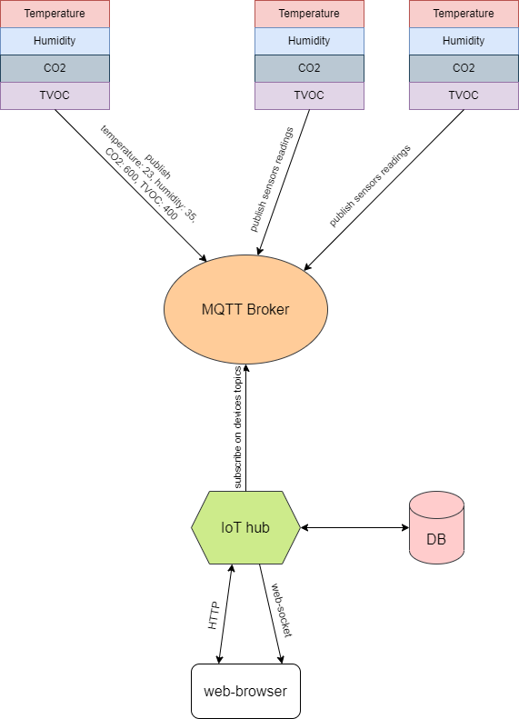

# Web application to control smart home and IoT-devices

The application is intended for controlling IoT devices and watching the sensors reading as realtime data as view the historical data. 
The application is written in Python with Flask framework. I'm planning to run it on either Raspberry Pi or Orange Pi. 

## Design overview
The application receives sensors data from IoT devices via MQTT protocol. These data put into DB for historical analysis and sent 
into web browser for real-time observation. Streaming of data into browser is done with websocket protocol. 

IoT devices are registered on hub application (for now manually) and publish sensors readings in format known to hub application 
in MQTT topics which agreed with hub application too. Received samples are sent to web-page via web-socket so that user may see 
the current values of monitored values and their dynamic during the short period of time (via charts). To watch the sensors 
reading in the past the application stores them in database. The data can be viewed in table format, as charts and be download 
as reports in MS Excel and CSV formats.

## Related project(s)
[Home weather station](https://github.com/PeterMoroz/home_weather_station)